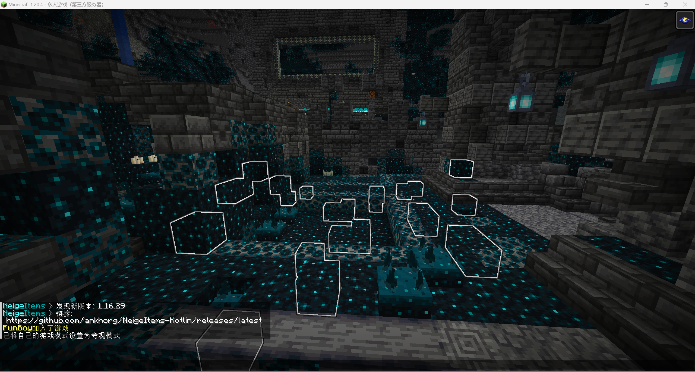

# 🧳Archeology Block

Archaeology blocks are stored in the `blocks` folder, and the name of the configuration file is the ID of the block.

The configuration file for an example archaeology block is as follows:

**! After finish config, you need use /ca archify command to start generation in game world. !**

```yaml
general:
  # The name of archaeology block
  display-name: "Suspicious Deepslate"
  # The vanilla blocks that will be replaced when generating new archeology block
  replace-block: deepslate
  # The whitelist of biomes that archeology block will generate at.
  # Support type all to means all biomes.
  biomes: all
  # The archeology block generate height of world.
  distribution: 0 ~ 127
  # Adding this option represents using Gaussian algorithm to generate archaeology blocks
  gaussian:
    # The mean for archeology block height distribution.
    # Must be a value included in the distribution option. 
    # For example, 32 here is greater than 0 but less than 127.
    mean: 32.0
    # The standard deviation of Gasussian algorithm.
    standard-deviation: 64.0
  # Adding this option represents using structural rules to generate archaeology blocks
  # Require LATEST 1.20.4+ server core jar.
  structure:
    # Only support type one strucutre type here.
    type: ancient_city
  # Adding this option represents using region rules.
  region:
    # For BetterStucutures plugin
    betterstructures: 
      - One
      - Two
    # Or betterstructures: all
  sound:
    # The sound effect when placing the block.
    place: 'BLOCK_STONE_PLACE'
    # The sound effect when brush failed.
    brush: 'BLOCK_SUSPICIOUS_SAND_BREAK'
  # The durability value of tools consumed during archaeology block excavation
  consume-durability: 1
  # The max blocks that will try generate per chunk.
  # For structure type, it's mean per strucutre.
  # This is try times, not success generate times.
  max-per-chunk: 16
  # The loot tables of block.
  # Support type vanilla loot table ID here.
  loot-tables:
    - "stone"
  # Setting a number greater than 0 indicates that this block will regenerate after a certain period of time. During the regeneration process, this block cannot be destroyed. 
  respawn-delay: -1
# Tools available for excavating the archaeological block
brush-tools:
  # For vanilla brush
  brush:
    efficiency: 1.0
  # Support use vanilla item here.
  archaeological_shovel:
    efficiency: 1.0
  diamond_archaeological_shovel:
    efficiency: 2.0
  netherite_archaeological_shovel:
    efficiency: 3.0

# Various states of archaeological blocks
states:
  default:
    texture: "suspicious_deepslate_0"
    hardness: 1.0
  # The first state during excavation
  state_1:
    texture: "suspicious_deepslate_1"
    hardness: 1.0
  # The second state during excavation
  state_2:
    texture: "suspicious_deepslate_2"
    hardness: 1.0
  # The third state during excavation
  state_3:
    texture: "suspicious_deepslate_3"
    hardness: 1.0
  # Blocks to be replaced after excavation is completed
  finished:
    material: deepslate
```

World generation showcase:

<figure><figcaption></figcaption></figure>

If you can not find the archeology blocks easily, try add `max-per-chunk` value.

Here is we change this option to **1600** case (don't try this, it will make server lag if you have some players):

<figure><figcaption></figcaption></figure>

## Generate Rule

There are 3 types of generate rule, each block can only use 1 generate rule type:

* Random: Completely random block generation. Blocks that do not meet the following conditions are considered to be using this rule. (Generate when Loading Chunk)
* Gaussian: Use Gaussian distribution rules for height distribution, more like the vanilla ore distribution. When your archaeology block has the `gaussian` option, we will consider you are using this rule. (Generate when Loading Chunk)
* Strucutre: Only generated in structures. Only support one strucutre per block. When your archaeology block has the `structure` option, we will consider you are using this rule. (Generate when Loading Chunk)
* Region: Only support BetterStrucutres plugin for now. This generation rule is separate from the normal block generation by loading chunks, so you need to pay special attention to this. When your archaeology block has the `region`  option, we will consider you are using this rule. (Generate when Founding New Region Generated)


For generate when loading chunk: We support generate archeology block at loaded chunk.&#x20;

